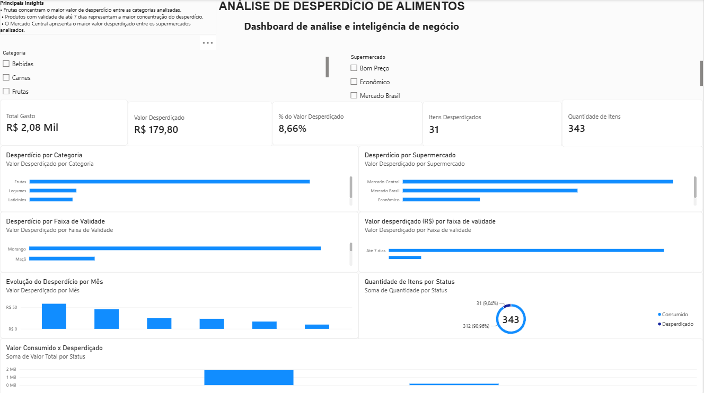

# FoodInsight — Dashboard de Desperdício de Alimentos

## 📊 Sobre o projeto

O FoodInsight é um projeto de análise de dados desenvolvido com o objetivo de transformar dados sobre consumo e desperdício de alimentos em informações visuais que facilitem a identificação de padrões e pontos de atenção.

O projeto utiliza Excel para estruturação dos dados e Power BI para análise e visualização das informações, resultando em um dashboard interativo.

## 🎯 Objetivo

Criar um dashboard capaz de apresentar indicadores e análises relacionados ao desperdício de alimentos, permitindo observar:

- Quantidade total de itens
- Quantidade de itens desperdiçados
- Valor total gasto
- Valor financeiro desperdiçado
- Percentual do valor desperdiçado
- Desperdício por categoria
- Desperdício por supermercado
- Desperdício por produto
- Desperdício por faixa de validade
- Evolução do desperdício por mês
- Comparação entre itens consumidos e desperdiçados

## 🛠️ Tecnologias utilizadas

- Power BI
- Microsoft Excel
- DAX
- Análise e visualização de dados

## 📈 Principais indicadores

| Indicador | Resultado |
|---|---:|
| Total de itens | 343 |
| Itens consumidos | 312 |
| Itens desperdiçados | 31 |
| Percentual de itens desperdiçados | 9,04% |
| Valor total gasto | R$ 2.080,00 |
| Valor desperdiçado | R$ 179,80 |
| Percentual do valor desperdiçado | 8,66% |

> 9,04% corresponde à proporção de itens desperdiçados, enquanto 8,66% corresponde à proporção do valor financeiro desperdiçado.

## 🔎 Principais análises

O dashboard permite analisar o desperdício a partir de diferentes dimensões, como categoria, supermercado, produto, validade e período.

Entre os principais insights identificados:

- Frutas concentram o maior valor de desperdício entre as categorias analisadas.
- Produtos com validade de até 7 dias representam a maior concentração do desperdício.
- O Mercado Central apresenta o maior valor desperdiçado entre os supermercados analisados.

## 📊 Dashboard

## 💡 Aprendizados

Durante o desenvolvimento do FoodInsight, foram praticados conceitos de:

- Estruturação e organização de dados
- Criação de indicadores
- Utilização de medidas no Power BI
- Criação de visualizações interativas
- Aplicação de filtros
- Análise exploratória de dados
- Interpretação de indicadores
- Geração de insights para apoio à análise de negócio

## 🚀 Possíveis melhorias

- Ampliar a base de dados
- Adicionar novos indicadores
- Criar análises mais detalhadas de custo e desperdício
- Desenvolver novos filtros e visualizações
- Acompanhar metas de redução de desperdício
